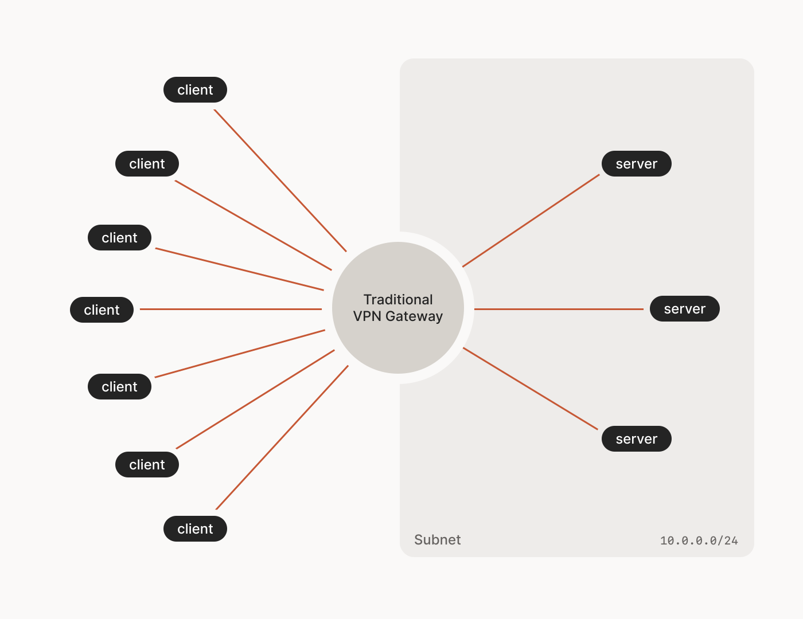
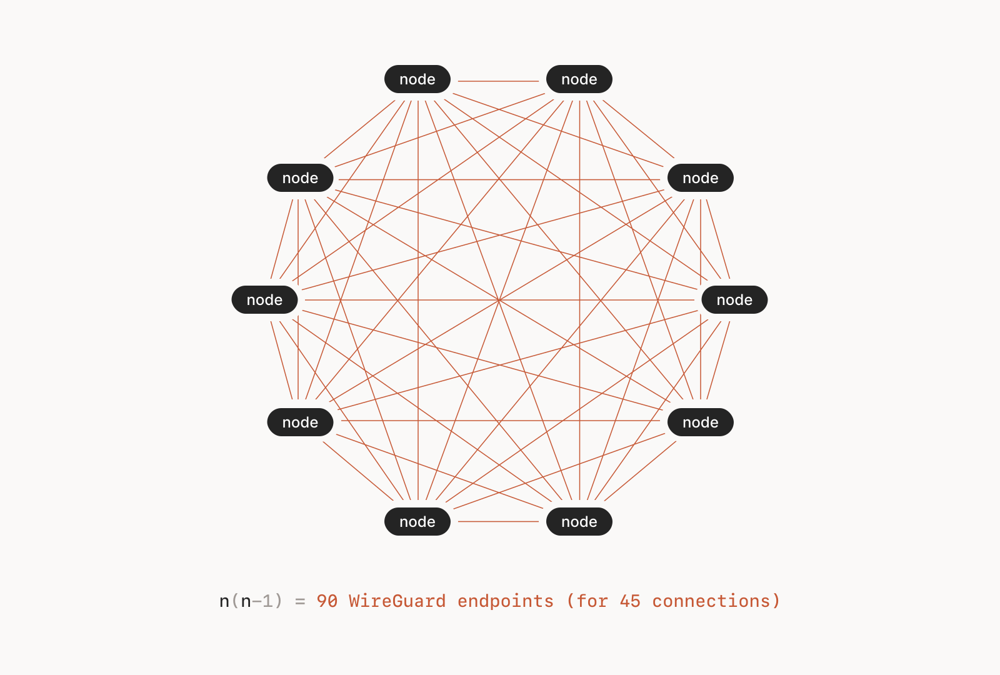

# 
Introducing Tailscale:

### 
... and the magic of pairing it with pfSense



## Redefining network topologies:
---

Wow. Just wow. 
It isn't often a novel project impresses me as thoroughly as Tailscale! 
So impressive that i'm reminded of Clarke's three laws; 
"Any sufficiently advanced technology is indistinguishable from magic". Spot on.  

There's something magical about a project which ticks so many boxes; 
It's 'simple' to setup, boasts near unlimited use cases, can be overlayed on top of an existing network - and it's 'free' tier is rather generous for individuals and likely to be all one needs. 
What happened to the old (and usually accurate) adage "we can only ever choose 2 between good|fast|cheap ?!"  

In this short blog i'll focus on how i've tag teamed Tailscale with pfSense for the ultimate NAT destroying chokeslam, but first let's hit on some features and network theory.

### Key Features:
---

- Enhanced Routing Efficiency
- Bypasses CGNAT / those behind double NAT
- No open ports on firewalls. No port forwarding
- Set any device to be an exit node
- Built in DNS resolution for all devices 
- Encrypted traffic between every node
- Cost-Effective Implementation
- Seamless WireGuard Integration
- Simplified Network Management
- Increased Scalability
- Low Latency Communication
- Cross-Platform Compatibility

These key features read well at first glance, however it's upon deeper introspection and using creativity of how it can be applied to your own network(s) that it truly sinks in - likely to the point of reaching an epiphany something along the lines of:   **"Where have you been all my life?!".**

### Comparing topologies:
---

The choice of topology plays a crucial role in determining the network's efficiency, security, and scalability.  
Two prominent models, the traditional Hub-and-Spoke and the innovative Mesh network, present distinct approaches to connecting remote locations. 
Let's look at a brief comparison between these two VPN topologies:

Above: The topology here screams inefficiency!

 
Above: Unless a centralized network is a must... the routing benefits, added security, low cost, and ease of implementation are rather attractive.

Oftentimes when visualizing something it makes a whole lot more sense: There's a lot of efficiency to be gained here.  
LINK: <a href="https://tailscale.com/blog/how-tailscale-works">Tailscales official 'how it works'</a> - a far more comprehensive explanation.

### My Tailscale + pfSense homelab:
---

**A game-changer:** 
In the ever-evolving landscape of home networking and server setups, the integration of Tailscale with pfSense has been a game-changer for redefining the dynamics of my homelab and devices.

Tailscale, with its simplicity and secure networking capabilities, seamlessly extends my local network, enabling easy access to devices from anywhere. The intuitive zero-config setup has transformed the way I connect to servers and resources, making remote work and access to LAN devices a breeze.

The 'free' tier generously provides up to 100 clients - however when you add pfSense as a node, create a simple outbound NAT rule and enable routing for your subnets and devices back through the Tailscale interface - this only counts as a single device on your tailnet. That's right, all clients behind your router are **zero config**!

The marriage of Tailscale's user-friendly Wireguard based VPN mesh with pfSense's robust networking capabilities not only redefines connectivity - but adds an extra layer of control and security to my network. 
Utilizing the versatility of pfSense allows for advanced configuration and policy routing, making it an ideal companion to Tailscale.  
This solution optimizes network performance, ensures security, and simplifies the management of my homelab + LAN + Cloud and remote device experience.  

### Benefits i'm enjoying:
---

**Bypassing CGNAT / Dbl. NAT:** 

My homelab is behind a Dbl NAT - which makes forwarding ports, and listening as a traditional server for incomming connections impossible. 
Not the case with Tailscale, users are able to simply bypass/traverse restrictive NAT networks with zero config. Actually mesh devices simply don't care where they are or what the topology of networks between each node look like; so long as the device can reach the main auth server, they will create encrypted tunnels. Wonderful.

**Each node has access to server resources and LAN subnets:** 

Simply set the subnets to advertise on each device;
- Seamless Resource Access: Enables users to access all servers and local area network (LAN) resources effortlessly, without the need for extensive configuration.
- Zero Configuration: Simplifies the user experience by eliminating the need for manual setup.
- SSH **just works**. External devices can now SSH into devices behind the firewall, as if they were local.

**Mount NAS devices - remotely just as if you were local:** 

- Remote NAS Access: Enables mounting of Network Attached Storage devices remotely, as if they were physically on the local network(!!).
- Seamless File Access: Facilitates easy access to files and data stored on NAS devices from any location.

**Using pfSense as an exit node:** 

- Devices can now share eachothers WAN/Internet connection, as if they originated from that device. 
- In my example, external devices can now easily share the traditional Wireguard VPN configured on pfSense as though they were on the LAN.

**Policy based routing:** 

- Traffic Control: Allows for the definition of specific routing rules based on policies, directing traffic according to predefined rules.
- Optimized Network Performance: Enables the optimization of network resources by directing traffic through designated paths.
- Load Balancing: Useful for balancing network traffic across multiple connections for efficient utilization.

**What about Cloud resources/VPCs?:** 

Simple. Install the daemon on any compute, auth. the device, share subnets - and like magic it's all accessible from every other device in your cluster.
Adding the cloud resource as an exit node has many use cases.

**How about the cons you ask?** 

A fair enough question. 
Thus far, the only con worth mentioning is the potential throughput limitation/bottleneck which - although i've personally never reached it - is inherent in the projects use of Go language; the networking stack for *BSD based devices is unfortunately in userland instead of the kernel. 
There is a well written blog on this topic in the official documentation.

**Alternatives:** 

There are a few competitors such as; 
- Twingate
- ZeroTier
- Headscale (self hosted Tailscale)

Which i'll be keeping an eye on to see which proves itself the king of overlay networking.

### Related Video:
---



##### <a href="https://github.com/tailscale/tailscale">Reveal the trick over on their Github page!</a>

---

